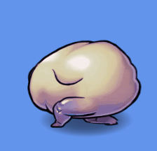

# Phaser 2 - Flump Plugin
<div style="text-align:center">
    
</div>

A plugin for Phaser 2 that loads and plays [Flump][1] animations. 

Flump is a tool that exports vector timeline animations from Adobe Animate to rasterized sprite atlases and JSON data. This plugin will allow developers to load Flump sprite atlases into Phaser's asset cache, and will parse Flump's library JSON to allow Phaser to play Flash-like animations.

This plugin is ported from the [Flump exporter][5] which was written in Actionscript 3 for Starling. It provides some improvements and additional features from its Actionscript counter part. Basing the plugin off the exporter allows it to provide the most accurate representation of how your animations look when viewed from the exporter.

## Improvements
- Smoother motion when interpolating between keyframes
- Playback complete and playback loop specific events
- A couple bug fixes

## Additional features
- Symbol pooling
- Ability to reuse movie symbols to play different animations
- Ability to adjust the playback speed of an animation

# Dependencies
## Phaser
This Flump plugin was built using [Phaser 2 CE][2] v2.13.3. Older versions of Phaser 2 may work, however were never tested.

## Flump
Exported Flump animation files are required to play any type of animation with this plugin. Please see the [Flump][1] documentation on how to setup and create animations within Adobe Animate/Flash and exported using the exporter tool.

The Flump exporter tool provides three different format types for exporting Flump assets. This plugin requires assets are exported as the JSON format type.

# Install
Install via NPM:

`npm install phaser2-flump-plugin`

Or include the built plugin bundle found in the dist folder of this repository. We provide both a minimized and non minimized build of the plugin, along with source maps for debugging.

# Usage
## Adding the plugin to Phaser 2's plugin manager
The first step is installing the plugin within your Phaser 2 game. This should be one of the first things your game does once it boots up. Simple import the plugin and added to `Phaser.Game.plugins`.

```javascript
import { FlumpPlugin } from 'phaser2-flump-plugin';

const game = new Phaser.Game(800, 600, Phaser.AUTO, undefined, {
    init() {
        game.plugins.add(new FlumpPlugin(game));
    }
});
```

Here you simply call `game.plugins.add(new FlumpPlugin(game))` within your game's initial state. This will add the plugin, so it can be used throughout your game. Before using anything in this plugin, it must be added to the game's plugins.

## Loading Flump assets through Phaser.Loader
Once the plugin has been added to your game you can now load your Flump assets. This can be done by using Phaser'2 load manager similar to how you would load any other asset type. The plugin provides a special Flump loader function that will handle loading each asset you provide it.

```javascript
import { FlumpPlugin } from 'phaser2-flump-plugin';

const game = new Phaser.Game(800, 600, Phaser.AUTO, undefined, {
    init() {
        game.plugins.add(new FlumpPlugin(game));
    },

    preload() {
        game.load.flumpAtlas("demoLibrary", "assets/flump/library.json", "assets/flump/atlas0.png");
    }
});
```

Similar to loading other assets within Phaser, we call `game.load.flumpAtlas(...)` and pass it three arguments.

The first is the library key, and will be considered the name for that library. This key is how you access your library data from Phaser's cache object. It is also used to make sure that all atlas PNGs have an unique name within the cache. Because the Flump exporter does not name the atlas images uniquely per library, the plugin will add the library key as a prefix to the image's filename. In this case, your atlas image is stored as `demoLibrary/atlas0.png`. Knowing this you can easily access individual frames from the Flump atlas by using `game.add.image(0, 0, "demoLibrary/atlas0.png", "greenSquareSprite")`.

The second argument is the URL to the `library.json` file. This file is the data file the Flump exporter will create that stores all the animation data within this library. It is stored within Phaser's cache using the library key provided for the first argument.

The third argument is the URL to the atlas image. Because the Flump export does not provide a way to change the naming scheme for exported atlas images, these images will be named `atlas0.png, atlas1.png, atlas2.png`... and so on. It's because of this that the library key is prefixed to be beginning of the filename when stored within Phaser 2's cache.

Optionally when loading a Flump atlas with multiple images, it is possible to provide `game.load.flumpAtlas(...)` with an array of atlas PNGs.

```javascript
preload() {
    const imgUrls = [
        "assets/flump/atlas0.png",
        "assets/flump/atlas1.png",
        "assets/flump/atlas2.png"
    ];
    game.load.flumpAtlas("demoLibrary", "assets/flump/library.json", imgUrls);
}
```

## Adding and removing libraries
### Adding
After you have loaded a Flump atlas, you can now add a library to the plugin. Adding a library allows the plugin to parse the `library.json` data and sets up a manager that will allow you to begin creating Flump animations within your game. You add a library by calling `game.flump.addLibrary(...)` and providing the key you used when loading the Flump atlas.

```javascript
import { FlumpPlugin } from 'phaser2-flump-plugin';

const game = new Phaser.Game(800, 600, Phaser.AUTO, undefined, {
    init() {
        game.plugins.add(new FlumpPlugin(game));
    },

    preload() {
        game.load.flumpAtlas("demoLibrary", "assets/flump/library.json", "assets/flump/atlas0.png");
    },

    create() {
        game.flump.addLibrary("demoLibrary");
    }
});
```

A library is a manager object that stores information about a group image and movie symbols. All this information is stored within the `library.json` and parsed once the library has been added to plugin. You should not attempt to use a library before adding it or after removing it.

### Removing
You can remove a library by calling `game.flump.removeLibrary(...)` and providing the name of the library you wish to remove.

Removing a library from the plugin allows it to be cleaned up and garbage collected. Any symbols being stored in the library will be destroyed. After a library is removed, any symbols that have not yet been stored that were created with that library should be considered unusable. These symbol should be manually destroyed, if not already within your scene's hierarchy and the library is being removed in your state's `shutdown()` function.

You should only consider removing a library once you are sure you are finished using it. Optionally, when removing a library you can tell the plugin to unload all of the atlas assets. Doing so will remove the `library.json` and atlas images from Phaser 2's cache and destroys the PIXI.BaseTexture objects. Any references to these assets will cause them to persist in memory.

Optional unloading example:
```javascript
shutdown() {
    game.flump.removeLibrary("demoLibrary", true);
}
```

## Creating movie symbols
Once a library has been added to the plugin it is ready to use. There are two different ways you can create symbols from your library: `createSymbol(...)` and `createSymbolFrom(...)`.

Using `createSymbol(...)` allows you to easily create any symbol that is defined in your library. You provide the name of the symbol you wish to create, and it is returned. The plugin will search each library that has been added and return the first instance of the symbol that matches the name you provided. This function will return either an image symbol or a movie symbol.

```javascript
import { FlumpPlugin } from 'phaser2-flump-plugin';

const game = new Phaser.Game(800, 600, Phaser.AUTO, undefined, {
    init() {
        game.plugins.add(new FlumpPlugin(game));
    },

    preload() {
        game.load.flumpAtlas("demoLibrary", "assets/flump/library.json", "assets/flump/atlas0.png");
    },

    create() {
        game.flump.addLibrary("demoLibrary");

        const movie = game.flump.createSymbol("orangeSquareScale");
        movie.position.set(game.width / 2, game.height / 2);
        game.world.add(movie);
    }
});
```

Here we are using `game.flump.createSymbol(...)` to create a movie symbol called "orangeSquareScale". We then position the movie in the center of the screen and add it to the world. That's it! You now have a playing Flump animation within Phaser 2.

Alternatively as mentioned above, you can use the `createSymbolFrom(...)` function to specify which library you want to look in to create the movie. This is partially helpful when you need more then one library added to the plugin at a given time. Sometimes multiple `library.json` may contain symbols with the same name. This function provides an alternatively way to create a symbol while avoiding naming collisions between different libraries.

```javascript
const movie = game.flump.createSymbolFrom("demoLibrary", "orangeSquareScale");
```

## Playback options
### Play once
By default when you create a new movie symbol its default state will loop. Sometimes you will only want an animation to play once. To do so you can call:

```javascript
const movie = game.flump.createSymbol("orangeSquareScale");
movie.playOnce();
```

Alternatively you can use `playOnce()` to assign the movie a new animations.

```javascript
movie.playOnce("orangeSquareRotate");
```

If the movie passed to `playOnce()` is the name as the current animation playing, then you can specify if you want the animation to restart or not. By default, animations will restart.

```javascript
// Do not restart if orangeSquareRotate is already playing
movie.playOnce("orangeSquareRotate", false);
```

Finally, you can provide `playOnce()` with an animation to fall back and loop after the first animation is complete. This is helpful if you need a character to return to an idle animation after playing a jump.

```javascript
// Play the new animation, leaving the restart flag as default, then once the new
// animation is complete begin looping "orangeSquareScale"
movie.playOnce("orangeSquareRotate", true, "orangeSquareScale");
```

### On playback complete
It's not uncommon to want to trigger some other action after an animation has completed. Movie symbols have a `Phaser.Signal` that you can attach listeners to in order to trigger events when an animation is complete.

```javascript
const movie = game.flump.createSymbol("orangeSquareScale");
movie.playOnce();

movie.playbackComplete.addOnce(() => {
    // TODO - Add your game logic here.
});
```

**NOTE:** It may be helpful to call `playbackComplete.removeAll()` if you pass a new animation to one of the playback functions. Assigning a new animation to a movie does not clear out its playback signal.

### Loop
When you create a movie, by default it is already setup to loop. However, if you need to restart the loop, or want to assign the movie a new animation to loop you can do so by using the `loop()` function.

```javascript
// Restart and loop the current animation.
movie.loop();
```

```javascript
// Loop the current animation without restarting it.
movie.loop(null, false);
```

```javascript
// Loop a new animation.
movie.loop("orangeSquareRotate");
```

### On playback loop
Sometimes it's helpful to trigger game logic every time a loop of an animation completes. For this you can use a movie's `playbackLoop` signal. It is important to note that `playbackComplete` does not fire if an animation is looping. So use `playbackLoop` to know with a cycle of a `loop()` completes, and `playbackComplete` when a `playOnce()` completes.

```javascript
const movie = game.flump.createSymbol("orangeSquareScale");
movie.playbackLoop.add(() => {
    // TODO - Add your game logic here.
});
```

**NOTE:** It may be helpful to call `playbackLoop.removeAll()` if you pass a new animation to one of the playback functions. Assigning a new animation to a movie does not clear out its playback signal.

### Stop
Not every animation should play on creation, or sometimes your game requires that you stop an animation from playing.

```javascript
const movie = game.flump.createSymbol("orangeSquareScale");
movie.stop();

// OR

const movie = game.flump.createSymbol("orangeSquareScale").stop();
```

## Frame labels
One of the nice features Flash animations have are frame labels. Frame labels are specific names that can be given to a keyframe. When Flump exports animations it will save these labels to each keyframe. This allows the plugin to fire events when the playback position reaches a keyframe with a label. You can listen for these labels to trigger different game logic within your game.

```javascript
const sound = game.add.sound("boop");
const movie = game.flump.createSymbol("greenSquareFrameLabels");

movie.labelEvents.add((label) => {
    if (label === "playSfx") {
        sound.play();
    }
});
```

Another use for frame labels is telling a movie to `goTo(...)` a specific label.

```javascript
const movie = game.flump.createSymbol("orangeSquareScale");
movie.goTo("someLabel").stop(); // Goes to and stops at someLabel.

// OR

const movie = game.flump.createSymbol("orangeSquareScale").goTo("someLabel").stop();
```

**NOTE**: `goto(...)` also works with frame numbers if you know the frame you want to go to. Just provide the frame number instead of a label.

You can also tell a movie to `stopAt(...)` a specific label. This will cause the movie to continue playing until the next time it reaches the specified label.

```javascript
const movie = game.flump.createSymbol("orangeSquareScale");
movie.stopAt("someLabel"); // Plays until it reaches someLabel.

// OR

const movie = game.flump.createSymbol("orangeSquareScale").stopAt("someLabel");
```

**NOTE**: `stopAt(...)` also works with frame numbers if you know the frame you want to go to. Just provide the frame number instead of a label.

# Building
If you need to add to or make changes to this plugin, you can build distribution and debug bundles. Follow these steps to create builds of the plugin.

To build the plugin you will require NPM. Head over and download [Node JS][4] to get started. After you have Node JS installed, open a command line tool and navigate to this project directory. Once there run the following command:

```
npm install
```

Whenever that is complete you can use the following commands to build the plugin. After the build is complete, the bundled plugin code can be found in the `build` folder.

## Debug
```
npm run build:debug
```

This command will build a debug version of the plugin. It will provide an unminimized version of the code along with source maps that can be used for debugging.

## Production
```
npm run build:prod
```

This command will build a minimized version of the plugin that can be included with your game files.

# Resources
We provide a [demo project][3] that provides examples of how to setup your project to use Flump animations. It also includes very basic implementation of each feature mentioned above.

# Versions
1.0 - Added

# License
Phaser 2 Flump Plugin is release under the [GPL-3.0 license][7].

# Created by
Phaser 2 Flump Plugin was created by [REDspace][6].


REDSpace and their respective logos are trademarks of REDSpace Inc. ©2019

[Flump][1] was created by Tim Conkling, Charlie Groves, and Bruno Garcia.

[1]: http://tconkling.github.io/flump/
[2]: https://github.com/photonstorm/phaser-ce
[3]: https://github.com/theREDspace/phaser2-flump-plugin-demo
[4]: https://nodejs.org/en/
[5]: https://github.com/tconkling/flump
[6]: https://www.redspace.com/
[7]: https://www.gnu.org/licenses/gpl-3.0.en.html